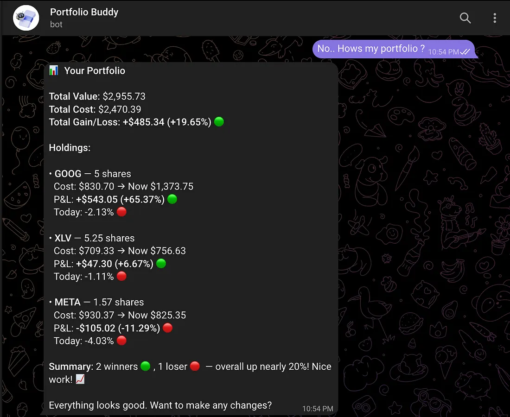
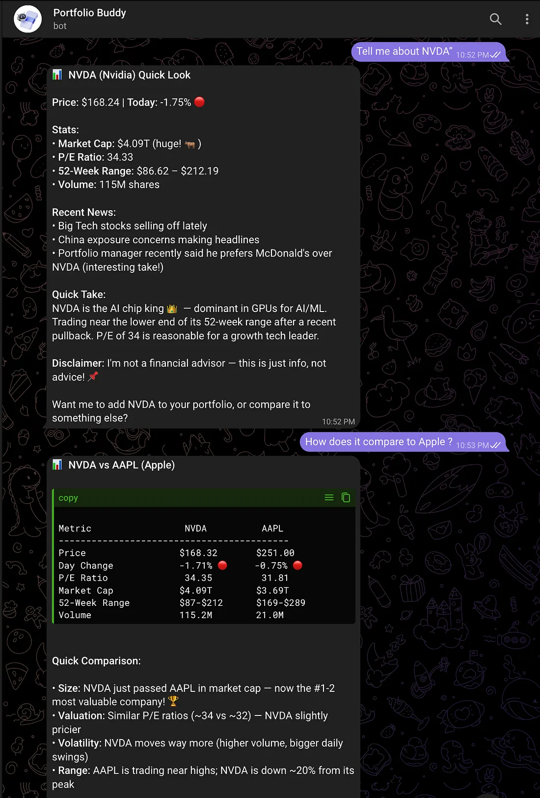
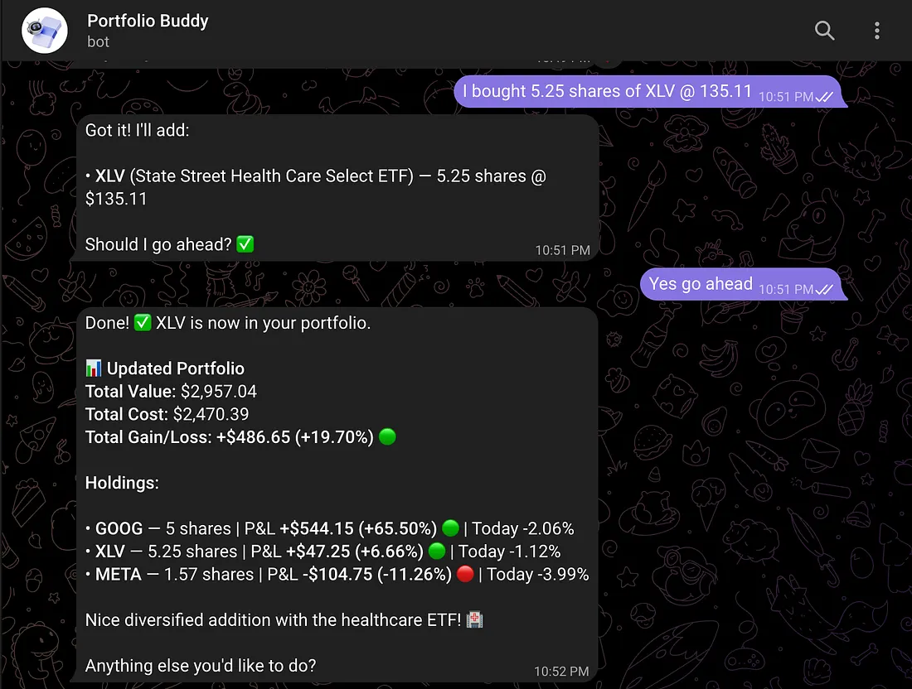

# PortfolioAgents-LangGraph

A hands-on article series on building AI agents with LangGraph — starting from first principles and progressing to real agentic systems. Each article builds on the previous one, evolving **PortfolioBuddy**, a Telegram-based stock portfolio assistant.

## What It Looks Like

<p align="center">
  
  
  
</p>

> Talk to PortfolioBuddy like a friend — check your portfolio, analyze stocks, compare side-by-side, and manage holdings through natural conversation on Telegram.

## Article Series

### Article 1: AI Agents from First Principles
Build a portfolio assistant on Telegram using LangGraph with state management, Yahoo Finance integration, and news sentiment analysis. Covers the basics — what agents are, how LangGraph works, and wiring up a functional bot.

- [Read on Medium](https://medium.com/@ujjwalgupta_97954/ai-agents-from-first-principles-a-hands-on-guide-with-portfoliobuddy-b37017b0dd77)
- [Code (`porfolioBuddyV1` branch)](https://github.com/gupta-ujjwal/PortfolioAgents-LangGraph/tree/porfolioBuddyV1)

**What's in v1:**
- LangGraph StateGraph with hardcoded routing (intent classification → fixed paths)
- Yahoo Finance market data + news sentiment via TextBlob
- CSV-based portfolio storage
- Telegram bot with `/start`, `/portfolio`, `/analyze` commands

### Article 2: What Makes an AI Agent Actually Agentic?
Tear apart v1's limitations and rebuild with real agency. The LLM picks its own tools, conversations persist across restarts, and failures are handled gracefully.

- [Read on Medium](https://medium.com/towards-artificial-intelligence/what-makes-an-ai-agent-actually-agentic-building-beyond-the-basics-with-langgraph-cf73c659d753)
- [Code (`master` branch)](https://github.com/gupta-ujjwal/PortfolioAgents-LangGraph/tree/master)

**What changed in v2:**
- ReAct agent with `create_react_agent` — LLM decides which tools to call
- 9 tools: portfolio summary, stock analysis, comparison, add/remove/update holdings, news, symbol lookup
- SQLite-backed persistent memory (conversations survive restarts)
- Error recovery with retry decorator + descriptive errors for LLM reasoning
- Multi-LLM provider support (Gemini, Perplexity, LiteLLM)
- Natural language portfolio management ("I bought 20 shares of AMD at $150")

### Article 3: Multi-Agent Systems *(Coming Soon)*
Splitting a single agent into specialized agents — research, risk management, execution. Multi-portfolio support, crypto, multi-country markets, and live news-driven suggestions.

## Quick Start

### Prerequisites
- Python 3.10+
- A [Gemini API key](https://makersuite.google.com/app/apikey) (free tier works)
- A [Telegram bot token](https://t.me/botfather)

### Setup

```bash
git clone https://github.com/gupta-ujjwal/PortfolioAgents-LangGraph.git
cd PortfolioAgents-LangGraph

python3 -m venv venv
source venv/bin/activate  # Windows: venv\Scripts\activate
pip install -r requirements.txt
```

### Environment Variables

```bash
cd PortfolioBuddy
cp .env.example .env
# Edit .env with your keys
```

Required:
- `GEMINI_API_KEY` — Google Gemini API key
- `TELEGRAM_BOT_TOKEN` — from @BotFather on Telegram

Optional:
- `LLM_PROVIDER` — `gemini` (default), `perplexity`, or `litellm`
- `NEWS_API_KEY` — for enhanced news (falls back to Yahoo Finance)

### Run

```bash
cd PortfolioBuddy
python agent.py
```

Then open your bot on Telegram and start chatting. No special commands needed — just talk naturally:
- "How's my portfolio doing?"
- "Analyze NVDA"
- "Compare AAPL and GOOGL"
- "I bought 50 shares of MSFT at $400"
- "What's the latest news on TSLA?"

## Project Structure

```
PortfolioAgents-LangGraph/
├── PortfolioBuddy/
│   ├── agent.py              # ReAct agent + Telegram bot
│   ├── tools.py              # 9 LLM-callable tools (market data, portfolio ops)
│   ├── portfolio_types.py    # TypedDict definitions and enums
│   ├── .env.example          # Environment variable template
│   ├── sample_portfolio.csv  # Sample portfolio to get started
│   └── requirements.txt      # PortfolioBuddy-specific deps
├── requirements.txt          # Top-level dependencies
├── CLAUDE.md                 # AI assistant context
└── README.md
```

## Branches

| Branch | Article | Description |
|--------|---------|-------------|
| `porfolioBuddyV1` | Article 1 | Smart workflow — hardcoded routing, CSV storage |
| `master` | Article 2 | Real agent — tool-calling, SQLite memory, error recovery |

## FYIs

- **Not financial advice.** This is an educational project. The bot gives analysis, not recommendations. Always do your own research.
- **Yahoo Finance rate limits.** If you hammer the bot with requests, Yahoo Finance may temporarily throttle you. The retry decorator handles transient failures, but give it a few seconds between rapid-fire queries.
- **SQLite memory grows.** The conversation memory DB (`portfoliobuddy_memory.db`) accumulates over time. Use `/reset` in Telegram to clear your conversation thread, or delete the `.db` file to start completely fresh.
- **Gemini free tier limits.** The free Gemini API has rate limits. For heavy usage, consider the paid tier or switch to another provider via `LLM_PROVIDER`.
- **Portfolio data is local.** Your holdings live in SQLite (`portfolio.db`) on your machine. Nothing is sent anywhere except stock symbols to Yahoo Finance and conversation text to your LLM provider.

## License

MIT — use it, learn from it, build on it.
